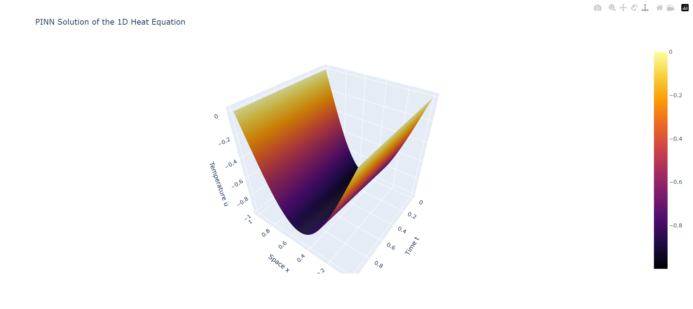

# Fabric Report: Physics-Informed Neural Network

## Interactive 3D Fabric

The trained PINN approximates the solution of the 1D heat equation over continuous space-time coordinates.

Interactive HTML version:

[Download and rotate the 3D fabric](https://github.com/hasanovmurad/genesis-oracle/blob/main/data/pinn_3d_fabric.html)

## Fourier Neural Operators

- A PINN learns one specific solution for one specific physical setup, while a Fourier Neural Operator learns a mapping from one function space to another function space.
- An FNO can take different initial conditions as input and predict the corresponding future solution without retraining from scratch.
- By applying convolution-like operations in the frequency domain, an FNO can capture global spatial patterns efficiently and generalize to new discretizations or initial conditions.