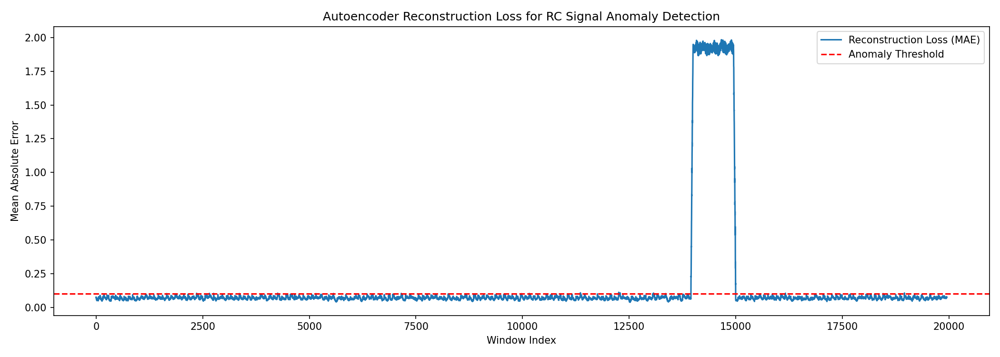
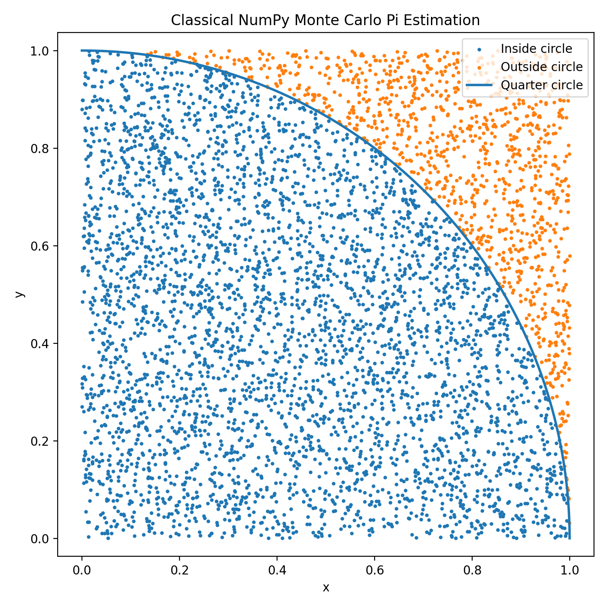
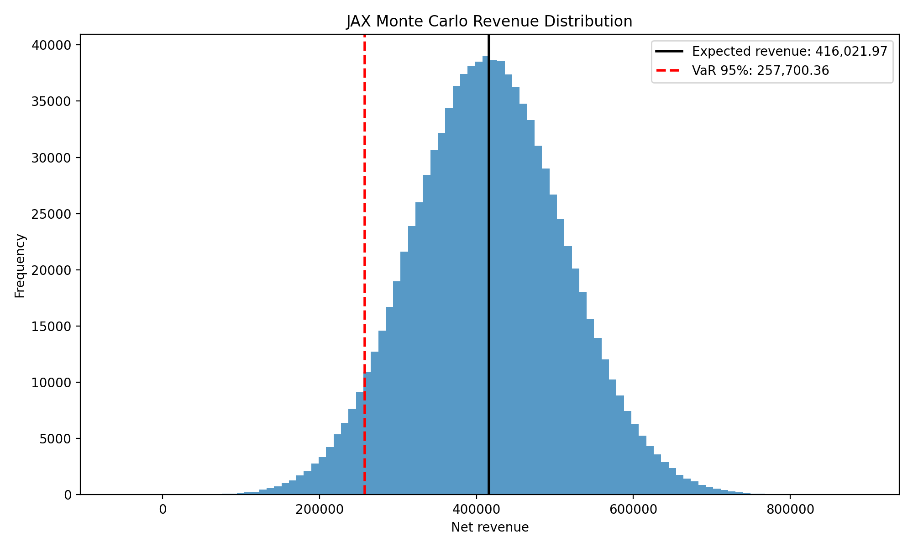
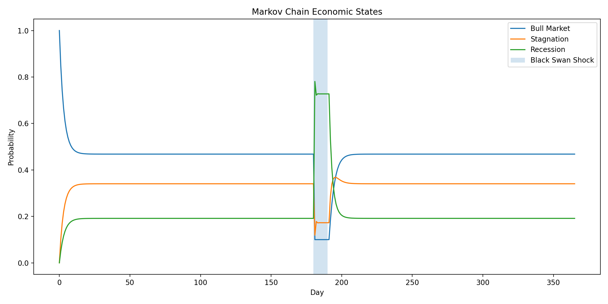

# Genesis Oracle

Project Genesis is a semester-long research and engineering project developed for **Angewandte Modellierung und Systemsimulation (SoSe 2026)**.

The project explores the evolution from classical physical simulation toward AI-assisted autonomous systems using:

* NumPy
* SciPy
* JAX
* Flax
* Keras 3
* Optax
* Gemini API
* Agentic Engineering
* Retrieval-Augmented Generation (RAG)
* Function Calling
* Gemma Skills

---

# Project Timeline

## Week 1 – Agentic Awakening

* Environment setup
* Gemini CLI integration
* Continuous system simulation
* RL circuit modeling
* Autonomous reporting agents

---

## Week 2 – Genesis Vault

* GitHub workflow
* uv dependency management
* Fourier synthesis
* RC filter simulation
* Synthetic anomaly generation

---

## Week 3 – Oracle Awakens

* Autoencoder architecture
* Keras 3 + JAX backend
* Anomaly detection
* Reconstruction-loss monitoring

---

## Week 4 – Silicon Ascension

* Massive oscillator simulation
* JAX vectorization
* JIT compilation
* Automatic differentiation
* Flax neural architectures

Performance:

| Metric        | Result |
| ------------- | ------ |
| NumPy Runtime | 2.77 s |
| JAX Runtime   | 0.04 s |
| Speedup       | 67.56× |

---

## Week 5 – Fabric of Reality

* Physics-Informed Neural Networks
* Heat equation approximation
* Mesh-free collocation
* Plotly 3D visualization

---

## Week 6 – Chaos Engine

* Monte Carlo Pi estimation
* Revenue-risk simulation
* Value-at-Risk analysis
* Markov Chain modeling
* Black Swan events

Generated Assets:

---

## Week 7 – Cerebral Nexus

* Gemini API integration
* Visual anomaly auditing
* Structured JSON control loops
* Prompt injection defense
* Cognitive simulation pipelines

Reports:

* Cerebral_Nexus_Report.md

---

## Week 8 – Sovereign Sentinel

* Local AI deployment concepts
* Queue simulation
* Closed-loop autonomous control
* Local RAG architecture
* SOP retrieval system

Reports:

* Sovereign_Sentinel_Report.md

---

## Week 9 – Autonomous Engineer

* JAX Mandelbrot simulation
* Manual AI-guided fractal exploration
* Autonomous tool-calling loop
* Gemma-Skill packaging
* Dynamic skill loading
* Autonomous parameter optimization

Reports:

* Autonomous_Engineer_Report.md

---

## Week 10 – Cognitive Core

* Google ADK integration
* Observer-Prime agent
* Native memory/state tracking
* ADK Web UI deployment
* Reactor temperature control tool
* Autonomous retry after safety warning

Reports:

* ADK_Report.md

---

## Repository

GitHub Repository

https://github.com/hasanovmurad/genesis-oracle

GitHub Pages

https://hasanovmurad.github.io/genesis-oracle/